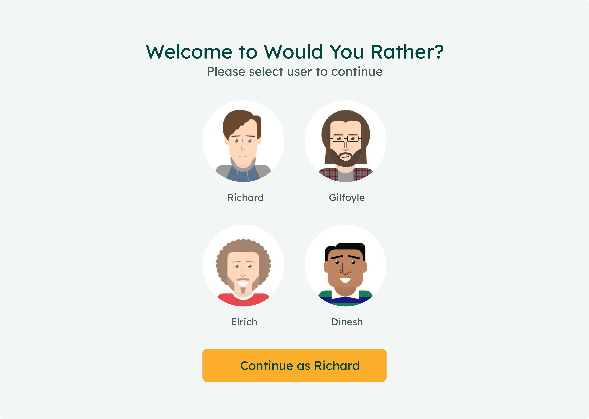

# Would You Rather

This is the second project submitted to Udacity React Nanodegree and this project focuses on advanced state management techniques using Redux in react.

## What i learnt?

- [x] Problems faced in basic state management
- [x] How Redux helps us in predictable state management
- Redux Core Concepts
  - [x] Store
  - [x] Actions
  - [x] Reducers
  - [x] Dispatchers
- [x] Using React and Redux
- [x] Using Redux Middlewares
- [x] Dispatching Actions to update Store via Reducers
- [x] React Router along with Redux

## Features

- 🌟 Customized Styles using CSS
- 🔥 Highly-Reactive UI
- 💡 Ready made components
- 🗺️ Routing using React Router
- ♻️ State management using Redux
- ❓ Answer a question
- 📊 Leaderboard to see scores
- 🗒️ Add a poll

## Installation

1. To Start with download node on your pc from its official site.
2. Install the dependencies

```
    npm install
```

3. Run the app

```
    npm start
```

4. See live in your local machine [here](http://localhost:3000/).

## Screenshots

Here's a quick overview of my project
and everything is based on Silicon Valley Theme


## Deploy

You can easily deploy your site using netlify and here are the steps
